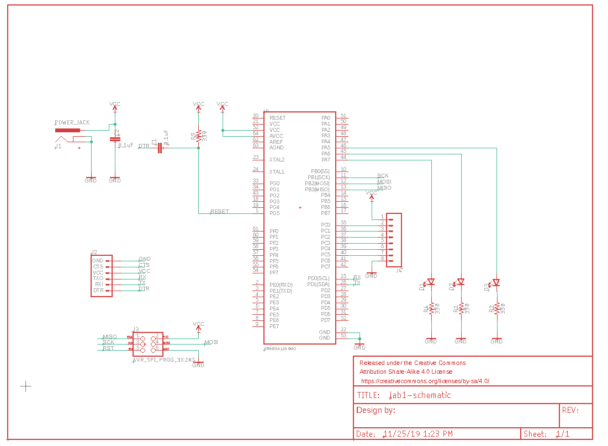
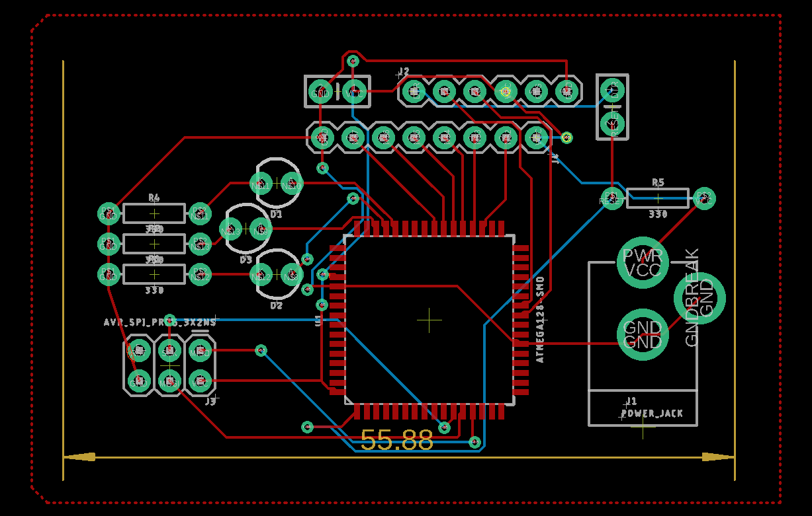

# Week 9 labs
Msc Creative Computing
Physical Computing #6 w/ Phoenix Perry
By Stuart Leitch
November 25, 2019

[Lecture PowerPoint](https://github.com/phoenixperry/cci-ual-pcomp/blob/master/week09/Tutorial_laserCutting.pdf)
[Lecture README](https://github.com/phoenixperry/cci-ual-pcomp/blob/master/week09/Week09.md)

## Lab #1: Learn Eagle via the tutorial

Eagle is a professional CAD software for designing circuitboards, which later go to fabrication. It's the next step beyond merely soldering.
Though it is professional, it doesn't actually install on Ubuntu. It just lives wherever you extract it to. 

Drawing a circuit was somewhat annoying, especially grabbing the center of each object to move or rotate. Still, given the large amount of obejcts included in the Sparkfun library, it was reasonably straightforward. Rather than use the suggested Arduino in the tutorial, I grabbed a MEGA from the collection to make things a bit more less copy and paste.

### The resulting circuit:

After drawing the circuit schematic, connecting the wires in a logical way proved to be its own challenge. Reminded me of those brain games where you have to route colored trains along tracks to their respective colored train garages. Eventually I got the whole circuit drawn on the board.

### The resulting board:

The primary question I have right now: Why is the board representation of the Arduino so dissimilar from the circuit diagram one? The only answer I can guess at is that this Arduino is only meant to be used on the circuit, and not used on the board side. In the future, when only using components, it may be clearer.